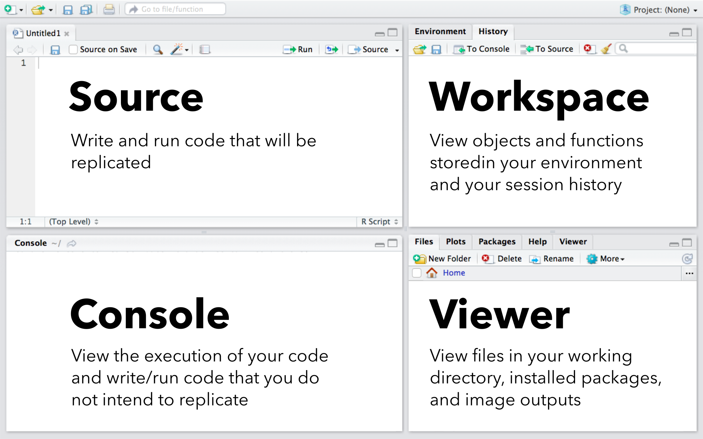

<!-- html head --> 

<head>
<link rel="stylesheet" href="https://cdnjs.cloudflare.com/ajax/libs/font-awesome/4.7.0/css/font-awesome.min.css">
<style>
.roundBorder {
  border-radius: 25px;
  border: 5px solid #30288C;
  background: #D6EAF8;
  padding-left: 20px;
  padding-right: 20px;
  padding-top: 10px;
  padding-bottom: 10px;
}

.roundBorderBlack {
  border-radius: 25px;
  border: 10px solid #D3D3D3;
  padding-left: 20px;
  padding-right: 20px;
  padding-top: 10px;
  padding-bottom: 10px;
}

.roundBorderBlackEx {
  border-radius: 5px;
  border: 5px solid #D3D3D3;
  padding-left: 5px;
  padding-right: 5px;
  padding-top: 2px;
}

.roundBorderEx {
  border-radius: 3px;
  border: 5px solid #30288C;
  background: #D6EAF8;
  padding-left: 5px;
  padding-right: 5px;
  padding-top: 2px;
}

h1 {
  font-size: 3.5em;
  font-family: "Avenir";
}

h2 {
  font-size: 3em;
  font-family: "Avenir";
}

h3 {
  font-size: 2.5em;
  font-family: "Avenir";
}

h4 {
  font-size: 2em;
  font-family: "Avenir";
}

h5 {
  font-size: 125%;
  font-family: "Avenir";
}

p {
  font-size: 125%;
  font-family: "Avenir";
}


ol {
  font-size: 125%;
  font-family: "Avenir";
}

ul {
  font-size: 125%;
  font-family: "Avenir";
}

.tt {
    position: relative;
    display: inline-block;
    class: inline; 
    font-weight: bold;
    font-family: "Avenir";
    font-size: 18px;
    border-bottom: 1px black;
}

/* Tooltip text */
.tt .ttText {
    visibility: hidden;
    font-weight: normal;
    font-size: 18px;
    width: 200px;
    background-color: black;
    border: 1px solid black;
    color: white;
    text-align: left;
    padding: 5px;
    border-radius: 6px;
    position: absolute;
    z-index: 1;
}

/* Show the tooltip text when you mouse over the tooltip container */
.tt:hover .ttText {
    visibility: visible;
}
</style>
</head>

<!-- intro -->

<h1>Before we begin</h1>
  
<p>This document will prepare you for the material presented in this course. At the bottom of the document you will submit your application. Before doing so, please read and complete the following steps. Even if you are entering this workshop with loads of R experience, please thoroughly read and complete each section of this document, as each section contains terminology you may be unfamiliar with and the beginnings of the R data science workflow that we will develop over the course of this workshop.</p>

<p>Throughout documents of this workshop there are a number of icons and formats to pay special attention to:</p>
<ul>
<li><i class="fa fa-user-circle-o" aria-hidden="true" style = "font-size: 100%"></i> Represents sections where user input is necessary.</li>

<li>Vocabulary terms are provided by tooltips in bolded text. If you would like to see the definition of a term, simply hover your mouse over the text (try it 
  <span class="tt">here
    <span class="ttText"><b>Tooltip</b>: An element of a user interface that provides information when a user hovers over an item with their mouse pointer.</span>
  </span>).</li>
<li>`Gray boxes` are sections that appear exactly as they would in the R environment. You may copy-and-paste these sections directly into R (CTRL+C to copy and CTRL+V to paste).</li>
<li><div class = "roundBorderBlackEx">White boxes with a thick gray border and a spy icon (<i class="fa fa-user-secret" aria-hidden="true" style = "font-size: 100%"></i>) provide tips and tricks for users. </div></li>
<li><div class = "roundBorderEx">Blue boxes provide summary information on keyboard shortcuts, operators, functions, and vocabulary.</div></li>
</ul>

<i>Important! Throughout this workshop we will be using keyboard shortcuts. Workshop documents refer to Windows/Linux keyboard mapping. Mac users should use "command" instead of CTRL to execute keyboard shortcuts.</i>

<hr style="border-width: 10px;">

<!-- intro to r studio -->

<h2>R and the R Studio environment</h2>
  
<p><i class="fa fa-user-circle-o" aria-hidden="true" style = "font-size: 150%"></i> Our first step is to ensure that you have R and R Studio Desktop installed on your computer.</p>
<ul>
<li> If you do not have R installed on your computer, <a href="https://www.r-project.org/" 
    target="_blank">
    <b>visit this link</b>
  </a> and follow the directions to do so.</li>
<li> If you do not have R Studio Desktop installed on your computer, <a href="https://www.rstudio.com/products/rstudio/download/"
    target="_blank">
    <b>visit this link</b>
  </a> and follow the directions to do so.</li>
</ul>

<p><i class="fa fa-user-circle-o" aria-hidden="true" style = "font-size: 150%"></i> Please ensure that both programs are installed on your computer and open R Studio.</p>

<br>

<p>R Studio is an interface to R that has numerous advantages over using R's built-in interface. More than anything, R Studio provides an environment that is easy to organize. R Studio is divided into four panels, as described in the image below. We will use panel names and their functionality considerably throughout this workshop, so please take a moment to familiarize yourself with them.</p>
<br>

<br>
<br>
<p><i class="fa fa-user-circle-o" aria-hidden="true" style = "font-size: 150%"></i> Open R Studio and create a new R <span class="tt">script     <span class="ttText">A file that contains all code for a set of operations.</span>   </span> in the  <span class="tt">source panel     <span class="ttText">A panel of R Studio for writing, editing, and running scripts.</span>   </span> using the keyboard combination <i>CTRL+SHIFT+N</i>. Even before you begin writing any <span class="tt">code<span class="ttText">Any text written in the source or console panel.</span></span>, it's good to save the script you will be working on. Save the file on your computer using the keyboard combination <i>CTRL+S</i>. Name the file "rIntro" (<i>note: the extension, ".R" will be assigned automatically</i>).</p>

<!-- source panel -->

<h3>The source panel</h3>
<p>The  <span class="tt">source panel     <span class="ttText">A panel of R Studio for writing, editing, and running scripts.</span>   </span> provides a useful interface for writing and editing <span class="tt">scripts<span class="ttText">A file that contains all code for a set of operations.</span></span> and is a great tool for observing and communicating what you have done. To execute <span class="tt">code<span class="ttText">Any text written in the source or console panel.</span></span> from the  source panel, place your cursor on the line you would like to run and use the keyboard shortcut CTRL+Enter. To run multiple lines of code at once, use your mouse to highlight the section of code you would like to run and hit CTRL+Enter.</p>
<br>

<p><i class="fa fa-user-circle-o" aria-hidden="true" style = "font-size: 150%"></i> Type `1+1+2` on the first line of your script in the source panel. Use the keyboard shortcut CTRL+Enter to execute the line of code that the cursor is on.</p>

<br>

<p><i class="fa fa-user-circle-o" aria-hidden="true" style = "font-size: 150%"></i> Type or copy-and-paste the following into the source panel, select the section of code with your mouse, and run the section using CTRL+Enter:</p> 

```{r eval = FALSE}
1+1+2
3*5*8
```

<br>
<p><i class="fa fa-user-circle-o" aria-hidden="true" style = "font-size: 150%"></i> You may also use your mouse and CTRL+Enter to run a subset of a line of code. Using your entry above, highlight just `5*8` with your mouse and hit CTRL+Enter to run.</p>

<p><i>Note: Make sure that you have CTRL+Enter in your muscle memory -- you are going to be using it a lot!</i></p> 

<br>

<div class = "roundBorderBlack">
<p><i class="fa fa-user-secret" aria-hidden="true" style = "font-size: 150%"></i>
 Any code that you will use more than once or upon which future lines of code depend should always be written and executed in the source panel.
</p>
</div>

<br>

<!--- console panel --->

<h3>The console panel</h3>
<p> The  <span class="tt">console panel<span class="ttText">A panel of R Studio used to execute code and writing/running code that users do not intend to replicate.</span></span> is the R Studio interface to program R. When a line of <span class="tt">code<span class="ttText">Any text written in the source or console panel.</span></span> is run from the command prompt (the symbol `>`) on the console, the interface sends the code to R which evaluates it and returns any potential output. When you ran the above sections of code from the  <span class="tt">source panel     <span class="ttText">A panel of R Studio for writing, editing, and running scripts.</span>   </span>, you may have noticed that the input and output appeared in the console panel. This highlights a component of how R Studio works: code written in the  source panel is sent to the console panel (CTRL+Enter), the console panel sends the code to R for evaluation, and R prints the results in the console panel (if applicable).</p>

<p>You can run code directly from the console panel. To do so, simply type the code you would like to run and press enter.</p>

<p><i class="fa fa-user-circle-o" aria-hidden="true" style = "font-size: 150%"></i> Type `1+1+2` after the command prompt on the console panel and press enter to run.</p>
<br>
<p><i class="fa fa-user-circle-o" aria-hidden="true" style = "font-size: 150%"></i> Copy-and-paste the following into the console panel and press enter to run the section:</p> 

```{r eval = FALSE}
1+1+2
3*5*8
```

<br>

<p><i class="fa fa-user-circle-o" aria-hidden="true" style = "font-size: 150%"></i> You can use your keyboard to navigate between lines of code you've run in the console panel. This can be especially useful for modifying part of a section of code. For example, use the up arrow on your keyboard to change the line `1+1+2` to `1+1+2+3`.</p>

<br>

<div class = "roundBorderBlack">
<br>
<p><i class="fa fa-user-secret" aria-hidden="true" style = "font-size: 150%"></i> Any code that you will use only once should be written and executed in the console panel. Do not write code into the console panel if future code elements will depend on the code's output!</p>
<hr style = "border: 1px solid #D3D3D3;">
<p><i class="fa fa-user-secret" aria-hidden="true" style = "font-size: 150%"></i> Mathematical operators are similar to that in Excel (e.g., `*` for multiplication and `/` for division). Likewise, R follows the conventional order of operations (i.e., the same order of operations you would find on a scientific calculator or in Microsoft Excel -- parentheses, exponents, multiplication/division, then addition/subtraction). For example, the mathematical expression:</p>

$$\frac{1+1+2}{3} + \frac{5}{8}$$

<p>Would be written in R as:</p>

```{r, eval=FALSE}
(1+1+2)/3+5/8 
```

<br>

<p>If you are new to R, please take a moment to explore using R as a calculator.</p>
</div>

<br>

<!-- workspace panel -->

<h3>The workspace panel</h3>

<p>When you open R you initiate an <span class="tt">R session<span class="ttText">Time spent and operations conducted since opening R (note: sessions may be saved and loaded to avoid lost work).</span></span>. An R session is defined by all of the <span class="tt">code<span class="ttText">Any text written in the source or console panel.</span></span> that you have run and any <span class="tt">objects<span class="ttText">One of many types of data stored in the R environment, such as individual values, functions, tables, lists, and images.</span></span> that you've stored in the <span class="tt">global environment<span class="ttText">A storage container that provides a reference point for all available objects in the current session.</span></span>. The  <span class="tt">workspace panel<span class="ttText">A panel of R Studio used to view/manage objects in your global environment and your session history.</span></span> is where you can view your global environment and your <span class="tt">session history<span class="ttText">All lines of code that have been sent to R since the beginning of a session (or since the session history was last cleared).</span></span>. In addition to viewing, you can use this panel to save or clean your session history and objects in your global environment. Using these tools can help streamline your R workflow and aid in replication.</p>

<br>
<p><i class="fa fa-user-circle-o" aria-hidden="true" style = "font-size: 150%"></i> Click on the "History" tab of the workspace panel to view the commands that you have run so far.</p>
<br>
<p><i class="fa fa-user-circle-o" aria-hidden="true" style = "font-size: 150%"></i> Click on the save icon on the history tab of the workspace panel. Save your history as "rWorkshop" (the file type will be added automatically). We will build on this file over the course of this workshop.</p>
<br>
<p><i class="fa fa-user-circle-o" aria-hidden="true" style = "font-size: 150%"></i> Click on the broom icon on the history tab of the workspace panel. This will remove everything you've done in R since your session began.</p>
<br>
<p><i>Note: The workspace panel contains tools for a number of other tasks, including tools for importing and exporting data and executing code. We will not be using most of these features in this workshop but you may want to explore them to determine whether you'd like to integrate them into your workflow.</i></p>
<br>

<div class = "roundBorderBlack">
<br>
<p><i class="fa fa-user-secret" aria-hidden="true" style = "font-size: 150%"></i> Be aware of how many objects are stored in your global environment. You can manage these objects on the "Environment" tab of the workspace panel. To limit the amount of data stored in memory and make best use of the workspace panel, be sure to remove unecessary objects.</p>
</div>
<br>


<!-- viewer panel -->

<h3>The viewer panel</h3>
<p>There is a lot going on in the <span class="tt">viewer panel<span class="ttText">A panel of R Studio used for navigating your system's files, viewing help files, and image/plot output (and more).</span></span>, but basically it provides tools for viewing anything other than command line output. The tabs on this panel include:</p>

<ul>
<li>Files: A file manager window (the initial location should default to your <span class="tt">working directory<span class="ttText">The location on your computer from which R reads or writes files.</span></span>).</li>
<li>Plots: Any plots that you create can be viewed here.
<li>Packages: R <span class="tt">libraries<span class="ttText">A set of community-generated functions (note: Also called a package).</span></span> that have been installed onto your system.
<li>Help: Help files that provide in-depth information into any R function that you will use.</li>
<li>Viewer: Images and maps can be viewed here.
</ul>

<p><i>Note: The viewer panel contains tools for a number of other tasks, including tools for loading and installing libraries and managing files. We will not be using most of these features in this workshop but you may want to explore them to determine whether you'd like to integrate them into your workflow.</i></p>

<hr style="border-width: 10px;">

<!-- assignment operator -->

<h2>The assignment operator</h2>

<p>In R, it is often useful to save <span class="tt">objects<span class="ttText">One of many types of data stored in the R environment, such as individual values, functions, tables, lists, and images.</span></span> in your <span class="tt">global environment<span class="ttText">A storage container that provides a reference point for all available objects in the current session.</span></span> by <span class="tt">assigning<span class="ttText">Provide a name for an R object.</span></span> a name to them. Assignment allows you to recall saved objects by typing the name rather than recreating the object. This is often necessary, as objects can be quite complex.</p>

<p><i class="fa fa-user-circle-o" aria-hidden="true" style = "font-size: 150%"></i> Type `hello world` into the <span class="tt">console panel     <span class="ttText">A panel of R Studio used to execute code and writing/running code that users do not intend to replicate.</span>   </span> and hit CTRL+Enter.</p>

<p>You should have received the error message: `Error: unexpected symbol in "hello world"`. If you aren't already, you will soon become super annoyed by messages like these. So what did you do wrong? When you type a word without quotes (which can be single or double), R thinks you are calling an object from your environment. The object was undefined, so it produced an error.</p> 

<br>
<p><i class="fa fa-user-circle-o" aria-hidden="true" style = "font-size: 150%"></i> Repeat the above, this time typing either `'hello world'` or `"hello world"` and running the line.</p>
<br>
<p><i class="fa fa-user-circle-o" aria-hidden="true" style = "font-size: 150%"></i> Now lets define our object. We'll make an object called `helloWorld` using R's assignment operator `<-`. Enter or copy-and-paste the following into the <span class="tt">source panel     <span class="ttText">A panel of R Studio for writing, editing, and running scripts.</span>   </span> and execute using CTRL+Enter:</p>

```{r eval = FALSE}
helloWorld <- 'hello world'
```

<br>

<p>You will notice there is no output in the console. If you look at the  <span class="tt">workspace panel<span class="ttText">A panel of R Studio used to view/manage objects in your global environment and your session history.</span></span>, however, you will see that your <span class="tt">global environment<span class="ttText">A storage container that provides a reference point for all available objects in the current session.</span></span> now contains a "Value" with the name helloWorld.</p>
<br>

<p><i class="fa fa-user-circle-o" aria-hidden="true" style = "font-size: 150%"></i> Type `helloWorld` into the console panel and notice the printed output.</p>
<br>

<p><i class="fa fa-user-circle-o" aria-hidden="true" style = "font-size: 150%"></i> Enter or copy-and-paste the following into the source panel and execute using CTRL+Enter:</p>

```{r eval = FALSE}
simpleAddition <- 1+1+2
```
<br>

<p>You have just created an object with the value of `1+1+2` and the name `simpleAddition`. You can use the name as a representation of the object.</p>
<br>

<p><i class="fa fa-user-circle-o" aria-hidden="true" style = "font-size: 150%"></i> Explore the results of the object that you created by typing the following in the console panel:</p>

```{r eval = FALSE}
simpleAddition*4

simpleAddition+2

simpleAddition/3
```

<br>

<p><i>Note: If you are new to R, you probably have yet to grasp how powerful assignments are. As most users begin to develop their R skillset, the number of assignments they use grows. What began as a useful tool can end up leading to an inevitable addiction that causes messy, hard-to-read scripts. In this course you will learn how to use assignments effectively and avoid the confusion that over-assignment causes.</i></p>

<br>

<div class = "roundBorderBlack">
<br>
<p><i class="fa fa-user-secret" aria-hidden="true" style = "font-size: 150%"></i> Do not use assignments unless you have to. Two key rules are:</p>
<ul>
<li>Only define an object if you truly want to use it in the future. We probably wouldn't really want to assign a name to `1+1+2` in the real world.</li>
<li>Make sure to explore the object prior to assigning a name to it. Assigning a name before testing an object can lead to headaches and unseen errors in your code.</li>
</ul>
<hr style = "border: 1px solid #D3D3D3;">
<p><i class="fa fa-user-secret" aria-hidden="true" style = "font-size: 150%"></i> Being careful with your naming conventions is very important! There are a lot of conventions out there for naming objects. The most important thing to avoid is naming an object and forgetting what you named it. The <span class="tt">workspace panel<span class="ttText">A panel of R Studio used to view/manage objects in your global environment and your session history.</span></span> can help you remember names (if you keep it clean), but the best practice is to use a consistent naming convention. Best management practices for naming objects include:</p>
<ul>
<li>Avoid using all caps and unnecessary capitalization. When misused, capitalization leads to extra keystrokes without conveying additional information.</li>
<li>Avoid using punctuation to separate words. For example, `hello_world` is a pain to type. Also, punctuation often conveys meaning that we may not intend. For example, assigning the name `hello.world` should be avoided because we should reserve the use of `.` to specify file types.</li>
<li>Do use <span class="tt">camel case<span class="ttText">A convention of writing in which multiple words are joined without spaces and all words following the initial word are capitalized.</span></span>! Camel case provides a clear distinction between words while avoiding too many keystrokes or symbols that convey meaning. Camel case is used in multi-word labels in which the first word is all lowercase and the first letter of any additional words is uppercase. For example, camel case would be written as camelCase.</li>
<li>Never, never, never, never include spaces in names!
</ul>
</div>

<hr style="border-width: 10px;">

<!-- commenting -->

<h2>Commenting out script: #comment!</h2>

<p>Good coding practices in most languages means adding plenty of descriptive content so you (and others) know what the <span class="tt">script<span class="ttText">A file that contains all code for a set of operations.</span></span> is doing at each point. This is known as adding <span class="tt">comments<span class="ttText">Use a `#` to communicate to R that the subsequent section of code will not be evaluated.</span></span> or commenting your script. Comments act as a rudder by making your scripts easy to communicate to others, adding structure to scripts, and helping you to retrace your steps when necessary. In R, you add a comment using `#`. R will not evaluate any part of a line that follows a hashtag.</p>

<p><i class="fa fa-user-circle-o" aria-hidden="true" style = "font-size: 150%"></i> Try running the following from the  <span class="tt">source panel     <span class="ttText">A panel of R Studio for writing, editing, and running scripts.</span>   </span> and observe what happens:</p>

```{r eval = FALSE}
# Adding a comment

1+1+2 # Adding a comment
```
<br>
<p>It is good to add a comment before steps in a <span class="tt">code<span class="ttText">Any text written in the source or console panel.</span></span> that describes what happens. Make sure that the comments you've added truly describe the process. Your comment should be able to provide a description of what a section of code is doing that outside observers can comprehend.</p>

<p><i class="fa fa-user-circle-o" aria-hidden="true" style = "font-size: 150%"></i> Add comments to the lines of code from the previous section:</p>

```{r eval = FALSE}
# Practing simple math and adding assignments:
simpleAddition <- 1+1+2

# Practicing adding an assignment to a computer-nerd phrase:
helloWorld <- 'hello world'
```
<br>

<div class = "roundBorderBlack">
<br>
<p><i class="fa fa-user-secret" aria-hidden="true" style = "font-size: 150%"></i> Script writing is like any other type of writing in that it is best to take your target audience into consideration when commenting a script. If you are new to R or writing code for someone who is just starting out, your script should be full of comments that explain every potentially confusing process. As you develop your R skills, or are communicating to more advanced R users, you will likely need less commenting. We will cover best management practices in commenting scripts considerably throughout this course.</p>
</div>

<hr style="border-width: 10px;">

<!-- functions -->

<h2>The function</h2>

<p><span class="tt">Functions<span class="ttText">Commands that can be used to execute complex or repetitive tasks.</span></span> are what data-wrangling-guru Hadley Wickham calls the "fundamental building block of R". Functions are a special type of R <span class="tt">object<span class="ttText">One of many types of data stored in the R environment, such as individual values, functions, tables, lists, and images.</span></span> that allow you to conduct often lengthy evaluations with limited work. The R environment contains many functions for data management, graphical display, and statistical analysis. To run a function, you type the name of the function followed by a set of parentheses enclosing what you want your function to evaluate.</p> 

<p><i class="fa fa-user-circle-o" aria-hidden="true" style = "font-size: 150%"></i> Combine the integers 1, 1, and 2 into a single object (the combine function in R is `c`) in the  <span class="tt">source panel     <span class="ttText">A panel of R Studio for writing, editing, and running scripts.</span>   </span> and name the object `firstSet`:</p>

```{r eval = FALSE}
# Combine values:
firstSet <- c(1,1,2)
```
<br>
<p>Before you use a function it is often necessary to get a good sense of how it works. The "Help" tab of the <span class="tt">viewer panel<span class="ttText">A panel of R Studio used for navigating your system's files, viewing help files, and image/plot output (and more).</span></span> provides in-depth resources on each function. To access the help file for a given function simply type `?` followed by the name of the function in the <span class="tt">console panel<span class="ttText">A panel of R Studio used to execute code and writing/running code that users do not intend to replicate.</span></span>.</p>
<br>

<h4>Nested functions</h4>

<p>Functions can be nested inside other functions. In other words, you can run a function inside another function. This can avoid making unnecessary assignments. To understand <span class="tt">nested functions<span class="ttText">A function that is run inside of another function.</span></span>, it is important to recall that the name of an object is just a simplified way to call the object it describes.</p>

<p><i class="fa fa-user-circle-o" aria-hidden="true" style = "font-size: 150%"></i> Enter `firstSet` and `c(1,1,2)` in the console panel (separately) and note the output for each. Because `firstSet` <i>IS</i> `c(1,1,2)`, the assigned name and the object are interchangeable.</p>

<p><i class="fa fa-user-circle-o" aria-hidden="true" style = "font-size: 150%"></i> In the source panel, enter and run the following line of code to make a second set of numbers with the name `secondSet`:</p>
```{r eval = FALSE}
secondSet <- c(3,5,8)
```
<br>

<p><i class="fa fa-user-circle-o" aria-hidden="true" style = "font-size: 150%"></i> To explore nested functions, run the code below in the console panel, noting the nested and non-nested versions of the function and their output:</p>

```{r eval = FALSE}

# Non-nested combination of the number sets:

c(firstSet, secondSet)

# Combinations of the number sets using nested functions:

c(c(1,1,2), secondSet)

c(firstSet, c(3,5,8))

c(c(1,1,2), c(3,5,8))

```
<br>
<h4>Arguments in functions</h4>
<p>Many functions contain <span class="tt">arguments<span class="ttText">Conditions that modify the behavior of a function.</span></span> in addition to the object you are evaluating. These arguments modify the behavior of the function (<i>Note: Some arguments are necessary while some are optional</i>). For example, the function `mean` contains an argument `na.rm` that tells R whether you want to remove NA (data Not Available) prior to running the function.</p> 

<p><i class="fa fa-user-circle-o" aria-hidden="true" style = "font-size: 150%"></i> In the  source panel, make an <span class="tt">object<span class="ttText">One of many types of data stored in the R environment, such as individual values, functions, tables, lists, and images.</span></span> with two integers and an NA and <span class="tt">assign<span class="ttText">Provide a name for an R object.</span></span> the name `twoValuesWithNA` to the object. In the console panel, calculate the mean of the data with (na.rm = TRUE) and without (na.rm = FALSE) the modifier argument:</p>


```{r eval = FALSE}

twoValuesWithNA <- c(1, 2, NA)

mean(twoValuesWithNA, na.rm = FALSE)

mean(twoValuesWithNA, na.rm = TRUE)
```
<br>
<h4>Libraries of functions</h4>
<p>Many functions are available in base R but there are loads of functions that have been written by others and assembled into <span class="tt">packages<span class="ttText">A set of community-generated functions (note: Also called a library).</span></span> called <span class="tt">libraries<span class="ttText">A set of community-generated functions (note: Also called a package).</span></span> that you can download. These user-built libraries are very powerful and can automate many of the tasks you confront when coding. To download a library, you use the function `install.packages`. This function evaluates the name of a library, in quotation marks and installs the library on your computer. <i>Note: Each package will only be loaded once, therefore this process should be completed in the console panel</i>.</p>

<p><i class="fa fa-user-circle-o" aria-hidden="true" style = "font-size: 150%"></i> Install two libraries that we will use throughout the course of this workshop:</p>

```{r eval = FALSE}
install.packages('tidyverse')

install.packages('RCurl')
```
<br>
<p>Once a library is installed on your computer, it is almost ready to use, but not quite. You have to load the library into your environment using the function `library`. Installed libraries are defined objects therefore quotes are not necessary when loading them. <i>Note: This function needs to be run each time a new R session is initiated. Because future lines of code may be dependent on the library or libraries loaded, loading should always occur in the source panel.</i> </p>

<p><i class="fa fa-user-circle-o" aria-hidden="true" style = "font-size: 150%"></i> Load the tidyverse and RCurl libraries:</p>

```{r eval = FALSE}
# Load libraries:
library(tidyverse)
library(RCurl)
```
<br>
<div class = "roundBorderBlack">
<br>
<p><i class="fa fa-user-secret" aria-hidden="true" style = "font-size: 150%"></i> Libraries should always be loaded in the  <span class="tt">source panel     <span class="ttText">A panel of R Studio for writing, editing, and running scripts.</span>   </span>! It's best to load libraries one of three locations:</p>
<ul>
<li>At the top of the script</li>
<li>On a separate source script (to be covered in this workshop)</li>
<li>Within a user-created function (to be covered in this workshop)</li>
</ul>

<hr style = "border: 1px solid #D3D3D3;">

<p><i class="fa fa-user-secret" aria-hidden="true" style = "font-size: 150%"></i> Warning! In the early stages of learning R, or even later if you have not spent much time learning the language, you will find yourself falling into what I call the "library trap". The library trap works like this:</p> 
<ol>
<li>You need to manipulate your data in some way that you are unfamiliar with</li>
<li>You visit Google or Stack overflow and, reading through the answers, find sets of libraries that do what you want</li>
<li>You install and load the library and <i>potentially</i> move past the issue</li>
</ol>
<p><i>Why is this a problem?</i> Some of the libraries you stumble on will be critical to your current and future workflows. Most of the libraries found in this way will not. This turns scripts into a sloppy patchwork of libraries. It can make code very confusing to follow and lead to unseen errors (if the function does not do exactly what you perceive). If the issue can be solved with Base R or the packages you are currently working with, it will make your code more clear, help you avoid problems, and save you time in the future. In this workshop we will teach you a workflow to examine and remedy R problems using a core set of packages.
</p>
</div>

<hr style="border-width: 10px;">

<div class="roundBorder">
<p><b>Functions and operators</b></p>
<ul> 
<li>`c` Combine objects</li></li>
<li>`install.packages` Add a new library to a user's computer</li></li>
<li>`library` Add a new library to a user's current R session</li></li>
<li> `mean` Take the average of a set of values (note, use na.rm = TRUE in the presence of NA's)
<li>`<-` Assign a name to an object in R (assignment operator)</li></li>
<li>`?` Get help for a given function</li> 
</ul>

<hr style = "border: 1px solid #30288C;">

<p><b>Keyboard shortcuts</b></p>
<ul>
<li>CTRL+C: Copy</li>
<li>CTRL+V: Paste</li>
<li>CTRL+S: Save file</li>
<li>CTRL+Shift+N: New R script</li>
<li>CTRL+Enter: Execute line or section of code from the source panel</li>
</ul>

<hr style = "border: 1px solid #30288C;">

<p><b>Vocabulary</b></p>
<ul>
<li><b>Argument</b>: Condition that modifies the behavior of a function</li>
<li><b>Assign</b>: Provide a name for an R object</li>
<li><b>Camel case</b>: A convention of writing in which multiple words are joined without spaces and all words following the initial word are capitalized</li>
<li><b>Code</b>: Any text written in the source or console panel</li>
<li><b>Comment</b>: Use a `#` to communicate to R that the subsequent section of code will not be evaluated</li>
<li><b>Console panel</b>: A panel of R Studio used to execute code and writing/running code that users do not intend to replicate</li>
<li><b>Function</b>: Commands that can be used to execute complex or repetitive tasks</li>
<li><b>Global environment</b>: A storage container that provides a reference point for all available objects in the current session</li>
<li><b>Library</b>: A set of community-generated functions (note: Also called a package)</li>
<li><b>Nested function</b>: A function that is run inside of another function</li>
<li><b>Object</b>: One of many types of data stored in the R environment, such as individual values, functions, tables, lists, and images</li>
<li><b>Package</b>: A set of community-generated functions (note: Also called a library)</li>
<li><b>R session</b>: Time spent and operations conducted since opening R (note: sessions may be saved and loaded to avoid lost work)</li>
<li><b>Script</b>: A file that contains all code for a set of operations</li>
<li><b>Session history</b>: All lines of code that have been sent to R since the beginning of a session (or since the session history was last cleared)</li>
<li><b>Source panel</b>: A panel of R Studio used for writing, editing, and running scripts</li>
<li><b>Viewer panel</b>: A panel of R Studio used for navigating your system's files, viewing help files, and image/plot output (and more)</li>
<li><b>Working directory</b>: The location on your computer from which R reads or writes files</li>
<li><b>Workspace panel</b>: A panel of R Studio used to view/manage objects in your global environment and your session history</li>
</ul>
</div>

<hr style="border-width: 10px;">

<iframe src="https://docs.google.com/forms/d/e/1FAIpQLSfddeNoj8WJf_FyJTw9AaEOiHs56oKHoRvXqR5APKS9ik0_uA/viewform?embedded=true" width="100%" height="1500px" frameborder="0" marginheight="0" marginwidth="0">Loading...</iframe>